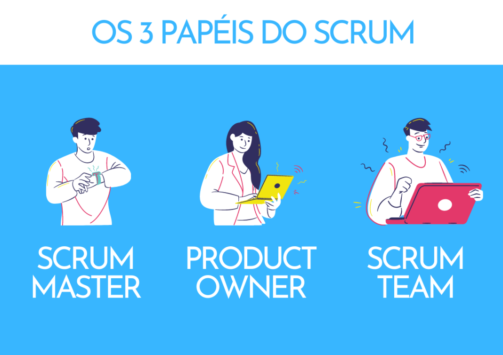
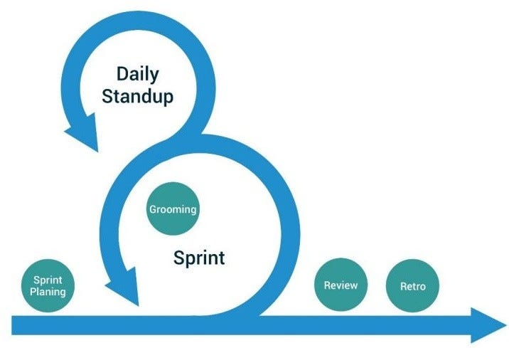
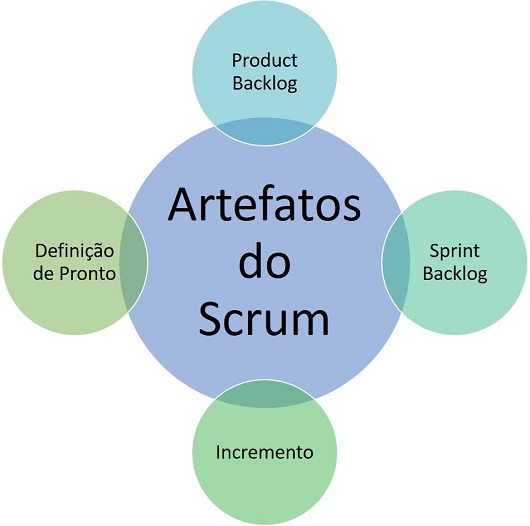

# Scrum

O Scrum é uma estrutura de gerenciamento ágil de projetos que auxilia as equipes a organizar e gerenciar seu trabalho através de um conjunto de valores, princípios e práticas. Inspirado no esporte de rúgbi, o Scrum incentiva a equipe a aprender com as experiências, se organizar para resolver problemas e refletir sobre sucessos e falhas para melhorar constantemente. Embora amplamente utilizado em equipes de desenvolvimento de software, os princípios do Scrum podem ser aplicados a diversos tipos de trabalho em equipe, tornando-o uma estrutura versátil e conhecida.

## Atores

- *PRODUCT OWNER*
- *SCRUM MASTER*
- *TIME DE DESENVOLVIMENTO*

**PRODUCT OWNER**

O Product Owner trabalha utilizando Scrum para agregar valor ao negócio frente aos stakeholders.
Ele é responsável por obter o valor máximo possível ao custo mínimo. Além disso, o Product Owner também é encarregado pelo portfólio de produtos, conhecido como Product Backlog. Por esse motivo, ele entende as necessidades dos usuários da empresa.

**SCRUM MASTER**

Um scrum master é o facilitador do scrum, uma estrutura ágil e leve focada em iterações com prazos definidos chamadas de sprints. Os scrum masters são os treinadores do restante da equipe, ou líderes servidores, segundo o guia do scrum.
Os bons scrum masters são comprometidos com os elementos básicos do scrum, mas também cultivam a flexibilidade e a mente aberta a oportunidades de melhoria nos fluxos de trabalho da equipe.

**TIME DE DESENVOLVIMENTO**

O Time de Desenvolvimento é um grupo multidisciplinar de pessoas, responsável por realizar o trabalho de desenvolvimento do produto. A partir das prioridades definidas pelo Product Owner, o Time de Desenvolvimento gera, em cada Sprint, um Incremento do Produto pronto, de acordo com a Definição de Pronto, e que significa valor visível para os clientes do projeto.

O Time de Desenvolvimento gerencia o seu trabalho de desenvolvimento do produto. É ele que determina tecnicamente como o produto será desenvolvido, planeja esse trabalho e acompanha seu progresso.

Para tal, tem propriedade e autoridade sobre suas decisões e, ao mesmo tempo, é responsável e responsabilizado por seus resultados.

## CERIMÔNIAS

- SPRINT PLANNING
- DAILY SCRUM
- SPRINT REVIEW
- SPRINT RETROSPECTIVE

**SPRINT PLANNING**

A reunião de planejamento da Sprint ou simplesmente Sprint Planning é a cerimônia ágil que marca o início de um ciclo de desenvolvimento dentro do framework Scrum.

**DAILY SCRUM**

A Daily Scrum é uma cerimônia de alinhamento. Ela possui algumas regras que garantem a sua celeridade, o seu objetivo e ao aproveitamento de todos, são elas:

- ela acontece todos os dias;
- no máximo deve durar 15 minutos e todos devem estar em pé;
- sempre acontece no mesmo lugar e no mesmo horário, combinado com todos;
- cada pessoa tem a sua vez de falar e os demais ouvem;
- cada pessoa fala para os demais membros do time, não há um chefe aqui e isso não é uma “prestação de contas”;

**SPRINT REVIEW**

A Sprint Review é a cerimônia que marca o fim de um ciclo de desenvolvimento do Time Scrum, apresentando os resultados obtidos ao longo da última sprint.

Mas qual a utilidade dessa cerimônia, afinal?

A primeira e mais óbvia é realizar uma entrega que gere valor ao cliente. O objetivo principal de toda sprint é gerar um Incremento de software com potencial de ser colocado em produção. Diz-se “potencial” pois a decisão de colocar ou não em produção pode ser algo maior do que apenas estar DONE do ponto de vista dos programadores, pode ser uma decisão de negócio. De qualquer forma, a missão da sprint deve ser sempre o mais próximo possível de colocar algo em produção que gere valor ao cliente. Com este mindset, a Review é este momento de entregar valor ao cliente com um intervalo entre as entregas de no máximo um mês.

A segunda finalidade é que, principalmente em projetos de inovação ou em ambientes complexos e adaptativos, deixar para fazer uma única entrega ao final do projeto é loucura. O escopo nunca é fechado neste tipos de projeto, o mercado muda muito rápido e muitas vezes o que você está desenvolvendo nunca foi feito antes, logo precisamos o tempo todo ajustar o rumo do projeto. A Sprint Review é um excelente momento para receber feedback dos stakeholders e ajustar o curso do projeto, garantindo a comunicação e diminuindo o risco do projeto como um todo.

**SPRINT RETROSPECTIVE**

A Sprint Retrospective é a cerimônia que encerra a sprint, servindo para inspecionar e adaptar os processos, ferramentas e relacionamentos do Time Scrum, visando melhoria contínua.

A Sprint Retrospective é uma cerimônia que deve acontecer sempre no último dia da sprint, para “fechar” a mesma. É uma cerimônia com duração máxima de três horas para cada trinta dias de sprint e é facilitada pelo Scrum Master. Nesta cerimônia que todo o Time Scrum deve participar, o objetivo é analisar tudo o que aconteceu nesta sprint que está encerrando e propor melhorias para a próxima.

## ARTEFATOS

- Product Backlog
- Sprint Backlog
- Definição de Pronto e Incremento

**Product Backlog**

No dinâmico mundo do desenvolvimento ágil de produtos, a organização e priorização das etapas que levarão à criação de soluções inovadoras são fundamentais. Neste cenário, o Product Backlog ou Backlog do Produto (traduzindo para o português) emerge como uma bússola estratégica, orientando equipes pelo mar turbulento de requisitos e funcionalidades. A importância deste artefato transcende a simples listagem; ele é a espinha dorsal do planejamento que, habilmente gerenciado pelo Product Owner, assegura que cada vela içada esteja alinhada com os ventos do mercado.

Na essência do desenvolvimento ágil, o Product Backlog é uma espécie de mapa do tesouro que guia os desenvolvedores ao longo da jornada criativa. Não é apenas uma lista qualquer, mas sim um conjunto de requisitos vitais, meticulosamente organizados por importância e urgência, que delineiam o caminho para um produto de valor inestimável. Esta ferramenta é um componente fundamental na definição do ciclo de vida do produto, pois ela ilumina as diversas etapas que o produto deve atravessar desde sua concepção até o lançamento e evolução no mercado.

Um backlog bem construído é repleto de funcionalidades, correções, melhorias e talvez até algumas peripécias que são necessárias para enriquecer a experiência do usuário final. Imagine uma árvore de Natal onde cada item da lista é um enfeite que será pendurado nos galhos; alguns são indispensáveis na base, enquanto outros aguardam pacientemente seu momento de brilhar no topo.

**Sprint Backlog**

O Sprint Backlog é um artefato dinâmico que encapsula a essência do trabalho a ser realizado em um Sprint no Scrum. Ele emerge do Product Backlog, filtrando as funcionalidades essenciais que serão implementadas na iteração em curso. A principal funcionalidade do Sprint Backlog é organizar as tarefas de forma que a equipe possa traçar um caminho claro para a entrega de valor ao final do Sprint.

É vital que o Sprint Backlog permaneça alinhado às decisões feitas na reunião de planejamento. Esta fidelidade garante que os objetivos estabelecidos sejam perseguidos com coerência, permitindo que a equipe mantenha o foco e a direção. No entanto, no dinâmico mundo do desenvolvimento de produtos, mudanças de curso são inevitáveis. Quando prioridades se alteram drasticamente ou o escopo do projeto se expande de maneira inesperada, o Product Owner possui a prerrogativa de interromper o Sprint para reavaliação e possível reinício, garantindo assim a entrega contínua de valor.

**Definição de Pronto e Incremento**

A Definição de Pronto é um instrumento fundamental no desenvolvimento de produtos e na gestão ágil de projetos. Este conceito, mais do que um simples termo técnico, representa um pacto de qualidade entre todos os envolvidos no processo, do product owner até o usuário final. Neste artigo, vamos explorar a importância da Definição de Pronto e os benefícios que ela pode trazer quando aplicada corretamente.

Uma boa Definição de Pronto é a base para a construção de um produto eficaz, garantindo que o incremento pronto não se transforme em um problema futuro. Com uma Definição de Pronto bem estruturada, é possível evitar riscos, alcançar a inovação e a agilidade necessárias em um mercado em constante movimento e, acima de tudo, entregar um produto ou serviço que realmente funciona.

A cada sprint, o time Scrum tem como objetivo gerar um incremento que pode ser ou não disponibilizado no produto para seu cliente.
O incremento é a entrega em forma de valor para o produto final sendo desenvolvido, em outras palavras, é a materialização do Product Backlog em produto final a ser consumido por seus clientes.

Um incremento só existe quando ele atende a Definição de Pronto que é uma descrição de como garantir que o item sendo validado está em conformidade com as medidas de qualidade exigidas para o produto.
A Definição de Pronto (também conhecida por DoD – Definition of Done) assegura que o incremento está, de fato, terminado e em condições de ser lançado.
Ao estipular critérios claros e objetivos, a Definição de Pronto garante que todos os membros da equipe estejam na mesma página, entendendo exatamente o que é necessário para que uma tarefa seja considerada completa. Sem uma DoD bem definida, o risco de cair na cilada do quase pronto é grande, o que pode gerar atrasos significativos no desenvolvimento do produto.

